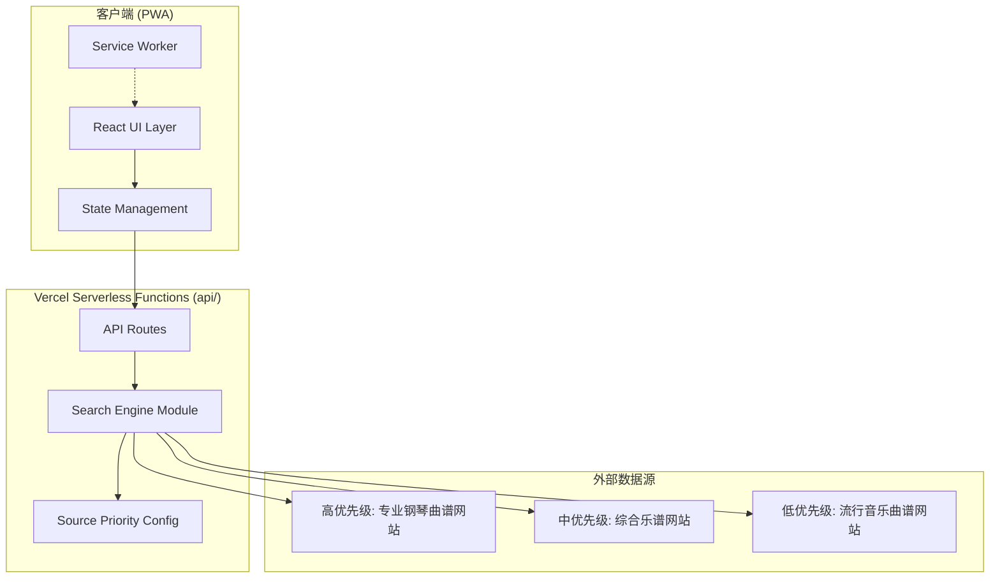
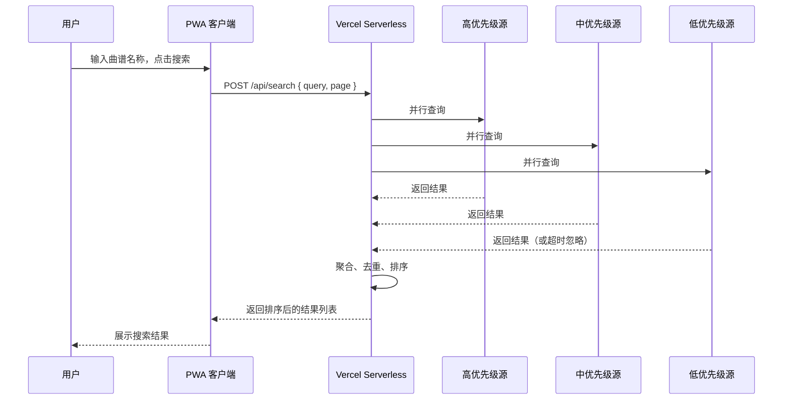
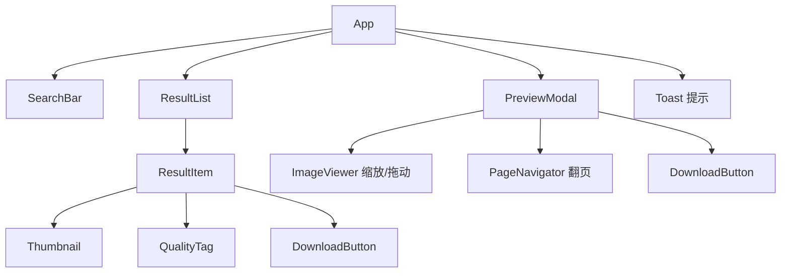

# 设计文档：乐谱搜索 PWA 应用

## 概述

乐谱搜索工具是一个面向 iPhone 用户的 PWA 应用，核心功能是聚合多个外部乐谱数据源，为钢琴教师提供高质量曲谱搜索、预览和下载服务。

### 技术选型

- **前端框架**: React 18 + TypeScript
- **构建工具**: Vite
- **PWA**: vite-plugin-pwa（基于 Workbox）
- **样式方案**: Tailwind CSS（移动优先响应式设计）
- **图片预览**: 自定义实现（基于 touch events 的缩放/拖动/翻页）
- **HTTP 请求**: fetch API
- **状态管理**: React Context + useReducer（轻量级，无需引入 Redux）
- **测试**: Vitest + fast-check（属性测试）
- **部署**: Vercel 免费方案（前端静态资源自动托管 + Serverless Functions 后端代理）
- **部署方式**: 代码推送到 GitHub，Vercel 自动构建部署，提供 `xxx.vercel.app` 域名，无需用户自备服务器

### 设计决策

1. **选择 React + Vite**: 生态成熟，Vite 构建速度快，PWA 插件完善，适合轻量级 SPA。
2. **不使用 SSR**: 本应用为纯客户端搜索聚合工具，无 SEO 需求，CSR 即可满足。
3. **后端代理层**: 使用 Vercel Serverless Functions（项目 `api/` 目录下的函数文件）代理外部数据源请求，避免 CORS 问题并隐藏 API 密钥。Vercel 免费方案即可满足需求，无需用户自备服务器。
4. **图片预览自定义实现**: 避免引入重量级图片库，使用原生 touch events 实现缩放和拖动，减小包体积。
5. **下载策略**: 多页乐谱使用客户端 JSZip 打包为 ZIP 文件下载，单页直接触发浏览器下载。

## 架构

### 整体架构



### 请求流程




## 组件与接口

### 前端组件树



### 核心组件接口

```typescript
// SearchBar 组件
interface SearchBarProps {
  onSearch: (query: string) => void;
  isLoading: boolean;
}

// ResultList 组件
interface ResultListProps {
  results: SearchResult[];
  currentPage: number;
  totalPages: number;
  onPageChange: (page: number) => void;
  onPreview: (item: SearchResult) => void;
  onDownload: (item: SearchResult) => void;
  onRefresh: () => void;
}

// ResultItem 组件
interface ResultItemProps {
  item: SearchResult;
  onPreview: () => void;
  onDownload: () => void;
}

// PreviewModal 组件
interface PreviewModalProps {
  item: SearchResult | null;
  isOpen: boolean;
  onClose: () => void;
  onDownload: () => void;
}

// DownloadButton 组件
interface DownloadButtonProps {
  item: SearchResult;
  onDownload: () => void;
  progress: number | null; // null = 未开始, 0-100 = 进度
}
```

### 后端 API 接口（Vercel Serverless Functions，api/ 目录）

```typescript
// POST /api/search
interface SearchRequest {
  query: string;
  page: number;    // 从 1 开始
  pageSize: number; // 默认 20
}

interface SearchResponse {
  results: SearchResult[];
  total: number;
  page: number;
  pageSize: number;
}

// GET /api/images?url={encodedUrl}
// 图片代理接口，解决跨域问题，返回图片二进制流
```

### 搜索引擎模块接口

```typescript
// 数据源适配器接口
interface SourceAdapter {
  readonly name: string;
  readonly priority: SourcePriority;
  search(query: string, page: number, pageSize: number): Promise<RawSearchResult[]>;
}

// 搜索引擎
interface SearchEngine {
  search(query: string, page: number, pageSize: number): Promise<SearchResponse>;
}

type SourcePriority = 'high' | 'medium' | 'low';
```


## 数据模型

### 核心数据类型

```typescript
// 搜索结果条目
interface SearchResult {
  id: string;                    // 唯一标识（来源+原始ID 的哈希）
  title: string;                 // 乐谱标题
  sourceName: string;            // 来源网站名称
  sourceUrl: string;             // 原始页面链接
  sourcePriority: SourcePriority; // 数据源优先级
  thumbnailUrl: string;          // 缩略图 URL
  imageUrls: string[];           // 所有页面的高清图片 URL 列表
  pageCount: number;             // 乐谱总页数
  qualityTags: QualityTag[];     // 质量标签列表
  matchScore: number;            // 标题与搜索关键词的匹配度分数 (0-1)
}

// 质量标签
type QualityTag = '高清' | '推荐';

// 数据源优先级
type SourcePriority = 'high' | 'medium' | 'low';

// 原始搜索结果（数据源适配器返回）
interface RawSearchResult {
  title: string;
  sourceUrl: string;
  thumbnailUrl: string;
  imageUrls: string[];
  pageCount: number;
}

// 数据源配置
interface SourceConfig {
  name: string;
  priority: SourcePriority;
  baseUrl: string;
  enabled: boolean;
  timeout: number; // 毫秒，默认 10000
}

// 下载任务状态
interface DownloadTask {
  resultId: string;
  status: 'idle' | 'downloading' | 'completed' | 'failed';
  progress: number;  // 0-100
  error?: string;
}
```

### 数据源优先级配置文件

数据源优先级通过 JSON 配置文件管理，无需修改代码即可调整：

```json
{
  "sources": [
    {
      "name": "专业钢琴曲谱网站A",
      "priority": "high",
      "baseUrl": "https://example-piano-a.com",
      "enabled": true,
      "timeout": 10000
    },
    {
      "name": "综合乐谱网站B",
      "priority": "medium",
      "baseUrl": "https://example-sheet-b.com",
      "enabled": true,
      "timeout": 10000
    },
    {
      "name": "流行音乐曲谱网站C",
      "priority": "low",
      "baseUrl": "https://example-pop-c.com",
      "enabled": true,
      "timeout": 10000
    }
  ]
}
```

### 搜索结果排序算法

排序规则按以下优先级执行：

1. **数据源优先级**: high > medium > low
2. **匹配度**: 同一优先级内，完全匹配 > 部分匹配（matchScore 降序）
3. **去重**: 相同标题的结果保留最高优先级来源的条目

```typescript
// 匹配度计算
function calculateMatchScore(title: string, query: string): number {
  const normalizedTitle = title.toLowerCase().trim();
  const normalizedQuery = query.toLowerCase().trim();

  if (normalizedTitle === normalizedQuery) return 1.0;       // 完全匹配
  if (normalizedTitle.includes(normalizedQuery)) return 0.8;  // 包含匹配
  // 基于关键词重叠的部分匹配
  const queryWords = normalizedQuery.split(/\s+/);
  const matchedWords = queryWords.filter(w => normalizedTitle.includes(w));
  return matchedWords.length / queryWords.length * 0.6;       // 部分匹配
}

// 排序比较函数
function compareResults(a: SearchResult, b: SearchResult): number {
  const priorityOrder = { high: 0, medium: 1, low: 2 };
  const priorityDiff = priorityOrder[a.sourcePriority] - priorityOrder[b.sourcePriority];
  if (priorityDiff !== 0) return priorityDiff;
  return b.matchScore - a.matchScore; // 同优先级按匹配度降序
}
```

### 去重算法

```typescript
function deduplicateResults(results: SearchResult[]): SearchResult[] {
  const seen = new Map<string, SearchResult>();
  // 结果已按优先级排序，相同标题保留第一个（最高优先级）
  for (const result of results) {
    const key = result.title.toLowerCase().trim();
    if (!seen.has(key)) {
      seen.set(key, result);
    }
  }
  return Array.from(seen.values());
}
```


## 正确性属性

*属性（Property）是指在系统所有有效执行中都应成立的特征或行为——本质上是对系统应做什么的形式化陈述。属性是人类可读规格说明与机器可验证正确性保证之间的桥梁。*

### Property 1: 有效输入触发搜索

*For any* 非空且非纯空白字符的搜索输入，无论通过点击搜索按钮还是按下回车键触发，搜索引擎都应发起一次搜索请求。

**Validates: Requirements 1.2, 1.3**

### Property 2: 空输入拒绝

*For any* 空字符串或仅由空白字符组成的输入，系统应拒绝搜索并显示提示信息，搜索引擎不应发起任何请求。

**Validates: Requirements 1.4**

### Property 3: 加载状态禁用重复提交

*For any* 正在执行中的搜索请求，搜索按钮应处于禁用状态，用户无法触发第二次搜索。

**Validates: Requirements 1.5**

### Property 4: 搜索结果按优先级和匹配度排序

*For any* 搜索结果列表和搜索关键词，排序后的结果应满足：数据源优先级高的排在前面；同一优先级内，标题与关键词完全匹配的排在部分匹配的前面（即 matchScore 降序）。

**Validates: Requirements 2.1, 4.1, 4.2, 5.2**

### Property 5: 搜索结果条目包含所有必要字段

*For any* 搜索结果条目，渲染后应包含：乐谱缩略图、乐谱标题、来源网站名称、质量标签、可点击的来源链接、数据源优先级信息和下载按钮。

**Validates: Requirements 2.2, 4.4, 9.1**

### Property 6: 高优先级来源结果显示质量标签

*For any* 来自高优先级数据源的搜索结果，该结果应至少包含一个质量标签（"高清"或"推荐"）。

**Validates: Requirements 2.8**

### Property 7: 分页限制

*For any* 搜索结果集，若总数超过 20 条，则每页展示的结果数量应不超过 20 条，且所有页面的结果总数等于去重后的总结果数。

**Validates: Requirements 2.7**

### Property 8: 去重保留最高优先级

*For any* 包含重复标题的搜索结果列表，去重后每个唯一标题应仅出现一次，且保留的条目应来自所有重复条目中优先级最高的数据源。

**Validates: Requirements 4.3**

### Property 9: 超时处理返回部分结果

*For any* 搜索请求，若某个数据源超时（超过 10 秒），系统应忽略该数据源并正常返回其他数据源的结果，返回的结果不应包含超时数据源的条目。

**Validates: Requirements 5.3**

### Property 10: 预览模态框页码指示器正确性

*For any* 包含 N 页图片的乐谱（N ≥ 1），预览模态框中的页码指示器应显示"当前页/总页数"，当前页范围为 [1, N]，且左右滑动切换时当前页应正确递增或递减。

**Validates: Requirements 8.3**

### Property 11: 多页乐谱下载完整性

*For any* 包含 N 页图片的乐谱，下载操作应生成包含恰好 N 张图片的文件包，且每张图片与原始图片 URL 列表一一对应。

**Validates: Requirements 9.3, 9.4**

### Property 12: 下载进行中禁用重复下载

*For any* 正在执行的下载任务，对应的下载按钮应处于禁用状态，且应显示下载进度（0-100%）。

**Validates: Requirements 9.5**

### Property 13: 匹配度计算一致性

*For any* 乐谱标题和搜索关键词，若标题与关键词完全相同（忽略大小写和首尾空白），则匹配度分数应为最高值；若标题包含关键词，则匹配度应高于仅部分词匹配的情况。即：完全匹配 > 包含匹配 > 部分词匹配。

**Validates: Requirements 4.1, 4.2**


## 错误处理

### 错误分类与处理策略

| 错误场景 | 处理方式 | 用户提示 |
|---------|---------|---------|
| 搜索输入为空 | 阻止请求，前端校验 | "请输入曲谱名称" |
| 搜索无结果 | 正常返回空列表 | "未找到相关曲谱，请尝试其他关键词" |
| 单个数据源超时 | 忽略该源，返回其他结果 | 无（静默处理） |
| 所有数据源失败 | 返回错误状态 | "搜索服务暂时不可用，请稍后重试" |
| 缩略图加载失败 | 显示占位图标 | 无（静默降级） |
| 高清图片加载失败 | 显示错误提示和重试按钮 | "图片加载失败，请检查网络后重试" |
| 下载失败 | 显示错误提示和重试按钮 | "下载失败，请检查网络后重试" |
| 离线状态 | 显示应用外壳和离线提示 | "当前无网络连接，请检查网络后重试" |

### 后端错误处理

```typescript
// 数据源请求包装，带超时和错误处理
async function fetchWithTimeout(
  adapter: SourceAdapter,
  query: string,
  page: number,
  pageSize: number,
  timeout: number
): Promise<RawSearchResult[]> {
  const controller = new AbortController();
  const timer = setTimeout(() => controller.abort(), timeout);

  try {
    const results = await adapter.search(query, page, pageSize);
    return results;
  } catch (error) {
    console.warn(`数据源 ${adapter.name} 请求失败:`, error);
    return []; // 静默降级，返回空结果
  } finally {
    clearTimeout(timer);
  }
}
```

### 前端错误边界

使用 React Error Boundary 捕获组件渲染错误，防止整个应用崩溃。关键组件（PreviewModal、ResultList）各自包裹独立的 Error Boundary。

## 测试策略

### 双重测试方法

本项目采用单元测试与属性测试相结合的方式，确保全面覆盖：

- **单元测试（Vitest）**: 验证具体示例、边界情况和错误条件
- **属性测试（fast-check）**: 验证跨所有输入的通用属性

两者互补：单元测试捕获具体 bug，属性测试验证通用正确性。

### 属性测试配置

- **库**: fast-check（TypeScript 属性测试库）
- **每个属性测试最少运行 100 次迭代**
- **每个测试必须用注释引用设计文档中的属性编号**
- **标签格式**: `Feature: sheet-music-search, Property {number}: {property_text}`
- **每个正确性属性由一个属性测试实现**

### 测试范围

#### 属性测试（Property-Based Tests）

| 属性编号 | 测试内容 | 生成器 |
|---------|---------|--------|
| Property 1 | 有效输入触发搜索 | 随机非空字符串 |
| Property 2 | 空输入拒绝 | 随机空白字符串（空串、空格、制表符等） |
| Property 3 | 加载状态禁用重复提交 | 随机搜索请求序列 |
| Property 4 | 结果排序正确性 | 随机 SearchResult 列表 + 随机查询词 |
| Property 5 | 结果条目字段完整性 | 随机 SearchResult 对象 |
| Property 6 | 高优先级质量标签 | 随机高优先级 SearchResult |
| Property 7 | 分页限制 | 随机长度的结果列表（1-200 条） |
| Property 8 | 去重保留最高优先级 | 含重复标题的随机结果列表 |
| Property 9 | 超时处理 | 随机数据源响应（含超时模拟） |
| Property 10 | 页码指示器正确性 | 随机页数（1-50）和滑动操作序列 |
| Property 11 | 下载完整性 | 随机页数的乐谱 |
| Property 12 | 下载禁用状态 | 随机下载任务状态 |
| Property 13 | 匹配度计算一致性 | 随机标题和查询词对 |

#### 单元测试（Unit Tests）

- **搜索输入**: 空输入提示、搜索按钮点击、回车触发
- **搜索结果展示**: 空结果提示、缩略图占位图、来源链接新标签页打开
- **数据源配置**: 配置文件解析、三级优先级验证
- **PWA**: Manifest 文件有效性、Service Worker 注册、standalone 模式
- **预览模态框**: 打开/关闭行为、加载状态、图片加载失败提示
- **下载功能**: 下载完成提示、下载失败重试
- **离线状态**: 离线提示显示
- **移动端**: 页面加载自动聚焦、下拉刷新
